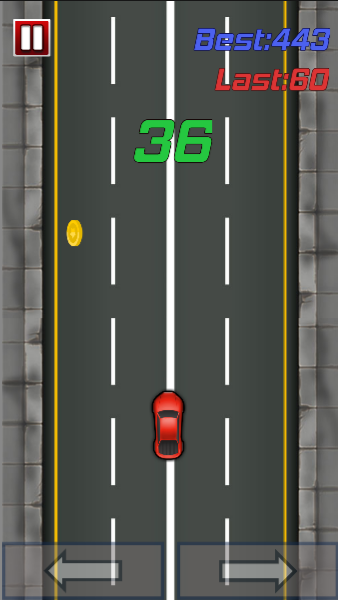

# 2D小汽车

## 这是什么

这个参考了https://www.sikiedu.com/my/course/614

原课程是使用的LayaAir2制作的，根据原课程的逻辑和素材，使用LayaAir3.14完成了本项目。

本项目仅供学习参考。

如有侵权，可联系1546909339@qq.com进行删除。

## 游戏玩法

游戏的内容是，玩家控制汽车，不断超越路上的其他的车辆，随着生存时间的增加，分数会越来越高，路上有几率刷新金币，如果获得金币，就能增加大量的分数。如果不小心擦到其他正常行驶的车辆，游戏就结束。游戏会记录最高分数和玩家上一局的分数，玩家可以不断打破最高记录。

玩家按下右边的屏幕，汽车就向右拐弯，按下左半边的屏幕，汽车就向左拐弯。

## 改进的内容

游戏内容在原来的基础上加了左右控制提示效果的按钮。

增加的双向车道，和中间为快速车道，两边为慢车道。

## 游戏截图

